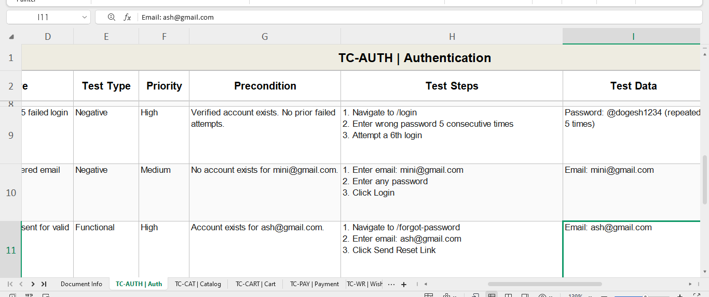
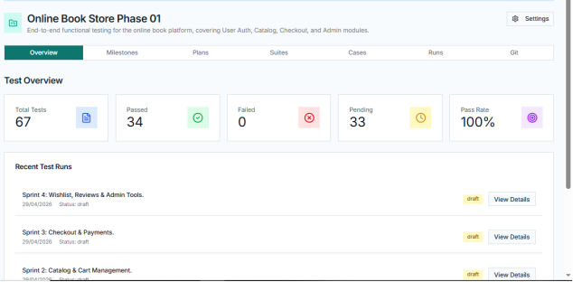

# Online Book Store - QA Test Case Design and Execution

**Assignment No. 2 | Quality Assurance | Farooque Sajjad**

---

## Project Overview

This repository contains the complete test case design and execution documentation for the Online Book Store project. The work is a direct continuation of Assignment 1, which produced the requirement analysis, user stories, and sprint plan. Assignment 2 translates those requirements into structured test cases, organizes them in a test management tool, and documents execution results.

The Online Book Store is a web-based e-commerce platform supporting three user roles: Guest, Registered Customer, and Administrator.

---

## 📂 Repository Structure & Detailed Contents

This repository is organized to demonstrate a professional QA lifecycle, moving from manual Excel-based tracking to advanced reporting within the **TestWorthy** management tool.

### **01. Manual Testing Documentation (Excel)**
**Folder:** `01_Test_Plan_Test_Cases_Results_Using_Excel`
*   **`Assignment_02_TestCases_OnlineBookStore_Farooque_Sajjad.xlsx`**: The primary test artifact containing 67 test cases across 7 modules, including detailed steps, expected results, and execution status.

### **02. Advanced Reporting (TestWorthy)**
**Folder:** `02_Test_Plan_Test_Cases_Results_&_All_Reports_Using_TestWorthy`
This section contains formalized PDF exports of the testing progress and strategy:

*   **01_Test_Plan_Report**
    *   `01_Online_Book_Store_Report_Test_plan_Complete.pdf`: The full strategic document outlining complete test plans.
*   **02_Milestone_Reports**
    *   `02_Milestone_Report_For_Auth_&_Search.pdf`: Progress tracking for Authentication and Search functionality.
    *   `03_Milestone_Report_For_Catalog_and_Cart_mgn.pdf`: Tracking for Product Catalog and Cart Management.
    *   `04_Milestone_Report_For_Checkout_&_Payments.pdf`: Focus on Transactional flows and Payment gateways.
    *   `05_Milestone_Report_For_Wishlist,_Reviews_&_Admin.pdf`: Reports on user engagement features and administrative controls.
*   **03_Test_Run_Reports**
    *   `06_Test_Run_Report_For_Auth.pdf` to `10_Test_Run_Report_For_Wishlist_Reviews_&_Admin_Tools.pdf`: Granular execution logs for each specific module, documenting every pass, fail, and re-test.

### **03. Workflow & Summary**
**Folder:** `03_Workflow_Report`
*   **`Assignment_02_QA_TestCases_and_Report_Farooque_Sajjad.pdf`**: A comprehensive final report that synthesizes the entire workflow, methodology, and final quality sign-off.

---

## Test Summary

| Metric | Value |
|---|---|
| Total Test Cases | 67 |
| Modules Covered | 7 |
| High Priority Cases | 33 |
| Functional Requirements Covered | FR-01 to FR-20 (100%) |
| User Stories Covered | US-01 to US-24 |
| Overall Pass Rate | 100% |

---

## Test Suites

| Suite ID | Module | Test Cases |
|---|---|---|
| TC-AUTH | Authentication | 11 |
| TC-CAT | Catalog and Search | 13 |
| TC-CART | Cart and Checkout | 8 |
| TC-PAY | Payment and Orders | 9 |
| TC-WR | Wishlist and Reviews | 7 |
| TC-ADM | Admin Functions | 11 |
| TC-EXT | Notifications, Discounts and Recommendations | 8 |

---

## Test Case Structure

Each test case contains the following fields:

- Test Case ID
- Linked User Story
- Linked Functional Requirement
- Test Objective
- Test Type (Smoke, Functional, Negative, Regression, Boundary)
- Priority (High, Medium, Low)
- Precondition
- Test Steps
- Test Data
- Expected Result
- Actual Result
- Status (Pass, Fail, Blocked)

---

## Excel Test Case Document

The Excel file was used as the primary authoring environment for all 67 test cases. It contains a Document Info sheet, seven module sheets, and an Execution Summary sheet with auto-calculated pass rates.

*Screenshot: Excel file open showing test case columns and sample rows from the Authentication module*

---

## Testworthy Test Management

All 67 test cases were manually entered into Testworthy after authoring them in Excel. The project in Testworthy contains one master test plan, four sprint milestones, and five test runs.

**Project Name:** Online Book Store Phase 01

*Screenshot: Testworthy project overview showing 67 total test cases, 34 passed, 33 pending, and 100% pass rate*

---

## Sprint Plan

| Sprint | Focus | Test Cases | Due Date |
|---|---|---|---|
| Sprint 1 | Authentication and Search | US-01, 02, 05, 06, 07 | 01-05-2026 |
| Sprint 2 | Catalog, Cart and Admin Catalog | US-03, 04, 08, 18 | 06-05-2026 |
| Sprint 3 | Checkout, Payment, Orders and Admin Orders | US-09, 10, 11, 12, 15, 19 | 12-05-2026 |
| Sprint 4 | Wishlist, Reviews, Discounts and Admin Users | US-13, 14, 16, 17, 20 | 19-05-2026 |

---

## Tools Used

| Tool | Purpose |
|---|---|
| Microsoft Excel | Test case authoring and offline reference |
| Testworthy | Test management, suites, runs, milestones, and execution tracking |
| VSCode with Cucumber Extension | Gherkin acceptance criteria authoring (from Assignment 1) |

---

## Notes

Testworthy does not support CSV or Excel import on the free trial tier. All 67 test cases were entered manually into the tool. The test type dropdown in Testworthy is limited to Functional, Regression, Performance, Security, and Automation. Types such as Negative and Smoke were mapped to Functional in the tool. The actual test type for each case is correctly documented in the Excel file and in the execution report.

---

## References

- Assignment 1: Requirement Analysis and User Story Writing
- Testworthy Documentation: https://docs.testworthy.us/

- Cucumber Gherkin Syntax: https://cucumber.io/docs/gherkin
