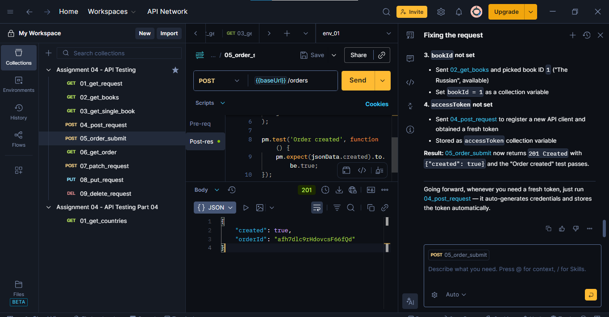
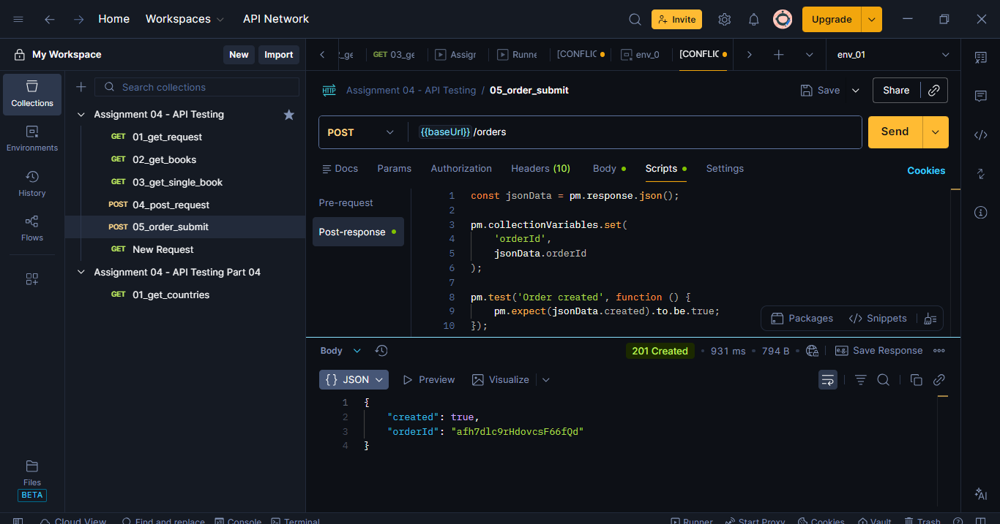
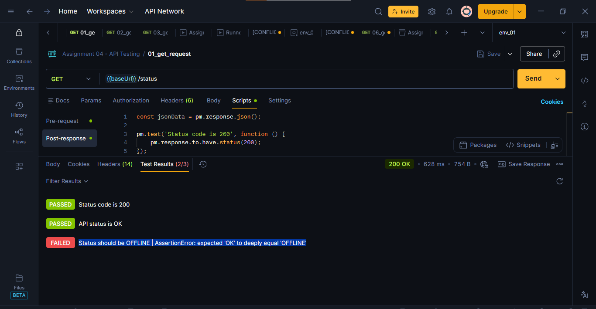
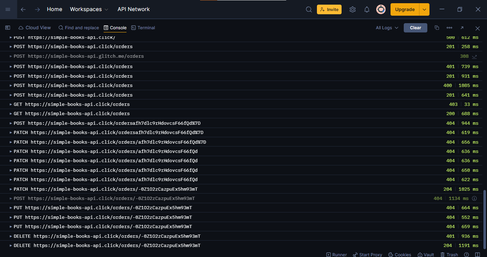

# Assignment 04 - API Testing Using Postman

## Project Overview

This project demonstrates REST API testing and automation using [Postman](https://www.postman.com?utm_source=chatgpt.com). The assignment covers complete CRUD operations, API chaining, authentication handling, dynamic variables, automated assertions, negative testing, and external API validation.

The APIs tested include:

* Simple Books API
* REST Countries API

The project was executed using Postman scripts, collection variables, automated test assertions, and request chaining workflows.

---

# Objectives

The main objectives of this assignment were:

* Understand REST API testing
* Learn CRUD operations
* Perform automated API validations
* Use Postman collection variables
* Implement API chaining
* Handle Bearer token authentication
* Practice debugging and troubleshooting
* Learn Postman scripting using Chai assertions
* Validate external APIs

---

# Technologies & Tools Used

| Tool            | Purpose               |
| --------------- | --------------------- |
| Postman         | API Testing           |
| JavaScript      | Postman Scripting     |
| Chai Assertions | Automated Validation  |
| REST APIs       | Backend Communication |

---

# APIs Used

## Simple Books API

[Simple Books API Documentation](https://www.postman.com/universal-comet-679843/simple-books-api-project-beginner-project/documentation/qbl3lrc/simple-books-api?utm_source=chatgpt.com)

Base URL:

```text
https://simple-books-api.click
```

---

## REST Countries API

[REST Countries API](https://restcountries.com?utm_source=chatgpt.com)

Endpoint Used:

```text
https://restcountries.com/v3.1/name/pakistan
```

---

# Features Implemented

* GET requests
* POST requests
* PATCH requests
* PUT requests
* DELETE requests
* API chaining
* Dynamic variables
* Automated assertions
* Negative testing
* Bearer token authentication
* External API testing
* Postman Console debugging

---

# Request Details

| Request Name       | Method | Purpose                                                  |
| ------------------ | ------ | -------------------------------------------------------- |
| 01_get_request     | GET    | Verify API availability and API status                   |
| 02_get_books       | GET    | Fetch list of available books                            |
| 03_get_single_book | GET    | Retrieve details of a specific book using chained bookId |
| 04_post_request    | POST   | Register API client and generate access token            |
| 05_order_submit    | POST   | Submit a new order using token and bookId                |
| 06_get_order       | GET    | Retrieve all submitted orders                            |
| 07_patch_request   | PATCH  | Partially update customer name in existing order         |
| 08_put_request     | PUT    | Fully replace/update order details                       |
| 09_delete_request  | DELETE | Delete existing order                                    |
| 10_countries_api   | GET    | Validate external REST Countries API                     |

---


# Project Workflow

```text
01_get_request
      ↓
02_get_books
      ↓
Save bookId
      ↓
03_get_single_book
      ↓
04_post_request
      ↓
Generate accessToken
      ↓
05_order_submit
      ↓
Save orderId
      ↓
06_get_order
      ↓
07_patch_request
      ↓
08_put_request
      ↓
09_delete_request
      ↓
10_countries_api
```

---

# Screenshot Section


## Screenshot 1 - Collection Overview



---

## Screenshot 2 - Successful Order Submission



---

## Screenshot 3 - Failed Assertion Test



---

## Screenshot 4 - Postman Console



# Assertions Used

Examples of assertions used:

```javascript
pm.response.to.have.status(200);

pm.expect(jsonData.status).to.eql('OK');

pm.expect(jsonData.length).to.be.greaterThan(0);

pm.expect(jsonData.accessToken).to.not.be.empty;
```

---

# Negative Testing

Intentional failing assertions were added to demonstrate error handling and validation failures.

Example:

```javascript
pm.test('Status should be OFFLINE', function () {
    pm.expect(jsonData.status).to.eql('OFFLINE');
});
```

---

# Issues Faced & Resolution

## 1. Environment Variables Missing

Initially, the following variables were unresolved:

```text
{{baseUrl}}
{{accessToken}}
{{bookId}}
```

This caused:

```text
401 Unauthorized
Missing Authorization Header
```

### Resolution

Using the built-in [Postman AI Assistant](https://www.postman.com/product/postbot/?utm_source=chatgpt.com), the issue was analyzed and resolved by:

* Creating environment variables
* Setting correct `baseUrl`
* Running authentication requests first
* Saving dynamic variables automatically

---

## 2. Incorrect HTTP Method

The request:

```text
04_post_request
```

was mistakenly configured as:

```text
GET
```

instead of:

```text
POST
```

### Resolution

The request method was corrected to:

```text
POST /api-clients
```

which successfully generated an `accessToken`.

---

## 3. Invalid API Base URL

The original URL:

```text
https://simple-books-api.glitch.me
```

was unstable and causing authorization issues.

### Resolution

The API mirror was updated to:

```text
https://simple-books-api.click
```

which resolved the issue successfully.

---

# Learning Experience

This assignment provided my first practical experience working with:

* Complete Postman collections
* Automated API testing
* Request-response validations
* Chai assertions
* API chaining workflows
* Authentication handling
* Debugging using Postman Console
* Collection variables
* External API testing

Before this project, I had never worked extensively with Postman collections, request automation, or response testing. This assignment helped me understand how backend APIs communicate and how QA engineers automate API validations in real-world environments.

---

# How to Run the Collection

## Step 1

Import collection JSON into Postman.

---

## Step 2

Create collection variables:

```text
baseUrl
countriesBaseUrl
accessToken
bookId
orderId
```

---

## Step 3

Run requests in sequence:

```text
1. 01_get_request
2. 02_get_books
3. 03_get_single_book
4. 04_post_request
5. 05_order_submit
6. 06_get_order
7. 07_patch_request
8. 08_put_request
9. 09_delete_request
10. 10_countries_api
```

---

# Conclusion

This assignment successfully demonstrated practical API testing concepts using Postman, including CRUD operations, authentication handling, API chaining, dynamic variables, assertions, debugging, and negative testing.

The project provided hands-on experience with backend testing workflows and improved understanding of real-world QA automation practices.
