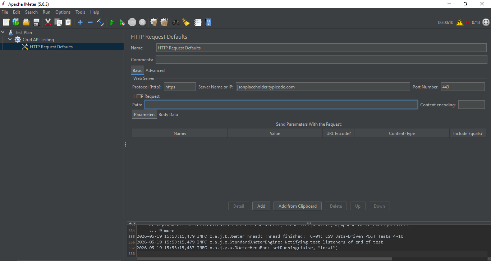
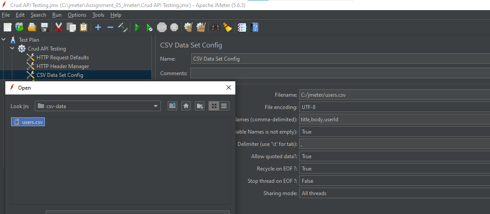
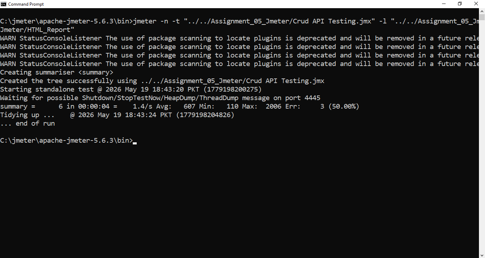
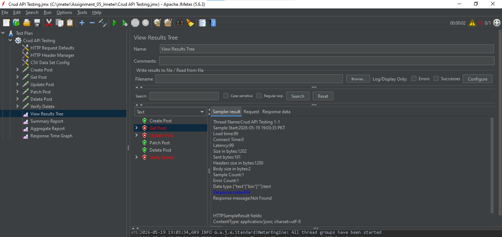
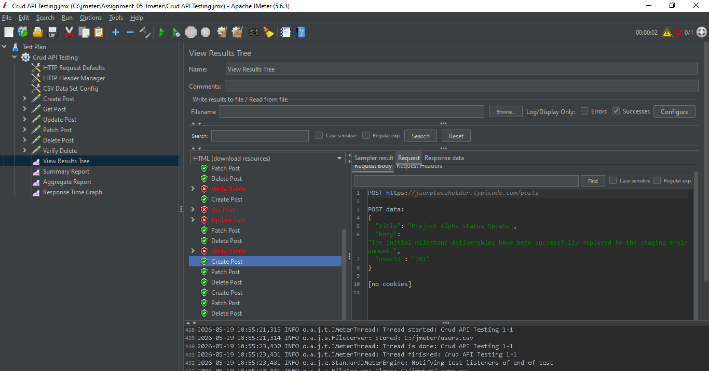

----

# API Performance Testing - JMeter

## 📌 Project Overview
This project contains an automated performance and functional test suite built using **Apache JMeter**. The goal of this assignment is to validate a complete **CRUD (Create, Read, Update, Delete)** lifecycle workflow against a mock REST API server (`jsonplaceholder.typicode.com`), utilizing data-driven testing strategies via a CSV dataset.

---

## 📁 Repository Directory Structure

```text
05_ASSIGNMENT_05/
├── Assignment_05_Jmeter/
│   ├── Reports/
│   │   └── HTML_Report/           # Contains generated test dashboard report
│   ├── Screenshots/
│   │   ├── 01_http_defaults.png
│   │   ├── 02_csv_config.png
│   │   ├── 03_assertion_setup.png
│   │   ├── 04_initial_cli_error.png
│   │   ├── 05_jmeter_404_gui.png
│   │   └── 06_final_success_tree.png
│   ├── TestData/
│   │   └── users.csv      # Professional 11-record payload dataset
│   ├── TestPlans/
│   │   └── Crud API Testing.jmx   # Main JMeter test plan script
│   └── WorkFlow_Report.md         # Narrative breakdown of execution
├── .gitignore
└── README.md                      # Main project documentation

```

---

## 🛠️ Environment Configuration & Tools

* **Testing Tool:** Apache JMeter 5.6.3
* **Execution Mode:** Non-GUI CLI (Command Line Interface)
* **Target Endpoint:** `https://jsonplaceholder.typicode.com`
* **Data Format:** JSON (`application/json`)

---

## ⚙️ Test Plan Setup Details

### 1. HTTP Request Defaults

Configured globally with Server Name `jsonplaceholder.typicode.com`, Protocol `https`, and Port `443`. The Base Path field was intentionally left blank to allow sub-samplers to append paths flawlessly without conflicts.

### 2. CSV Data Set Config

Mapped to the custom `users.csv` file, variables (`title`, `body`, `userId`) are parsed automatically to drive the parameters of each transaction dynamically.

### 3. Response Assertion Setup

Added as a child element under the samplers to programmatically validate that the server responds with a standard success status code of `200` and contains expected response text strings.

---

## 📉 Baseline Run Execution & Technical Challenges

When running the initial test plan profile using the CLI execution command, the summary metrics identified a **50.00% Error Rate**:

### Root Cause Analysis:

Upon opening the GUI interface to trace the failures, it was observed that `GET`, `PUT`, and `DELETE` actions targets returned a **404 Not Found** response code.

Because JSONPlaceholder acts as a static mock API server, it simulates a `201 Created` code on `POST` requests but does not actually persist the new values (like IDs `101`, `102`) into its persistent database. As a result, subsequent calls targeting `/posts/101` failed because the resource did not exist.

---

## 🚀 Rectification & Successful Verification

## Resolution:

The records inside the CSV configuration were updated to map strictly against pre-existing data rows on the active server instance (valid asset IDs ranging between `1` and `100`).

Following data adjustments, a clean execution was achieved, resulting in a **100% success rate with all 6 samplers passing perfectly (turning green) in sequence**:

---

## Execution Screenshots & Proof of Work

Below are the step-by-step configuration layout details, initial runtime exceptions, and the final verification metrics of the automated suite.

### 1. Test Setup Configurations

* **Global HTTP Defaults Layout**



* **External CSV Resource Mapping**



* **Status Code Rules, Assertions & JSON Extractors**


### 2. Debugging Run Metrics (Baseline Failures)

* **Terminal Baseline Run CLI Error**



* **View Results Tree 404 Failure Response**



### 3. Rectified Execution Proof (100% Passing Run)

* **Fully Resolved Successful CRUD Execution Tree**


---

## 🏁 Conclusion
This assignment successfully highlights the implementation of automated REST API performance testing using Apache JMeter.

By executing the test plan in non-GUI mode via the command-line interface (CLI), engine resource consumption was optimized, ensuring accurate benchmark metrics. Transitioning from generic hardcoded values to an external CSV dataset demonstrated the vital importance of data validity when dealing with mock servers.


---

## 📚 References
Apache JMeter User Manual: https://jmeter.apache.org/usermanual/

JSONPlaceholder Mock API Endpoint Documentation: https://jsonplaceholder.typicode.com/

JMeter Non-GUI CLI Run Execution Best Practices: https://jmeter.apache.org/usermanual/get-started.html#non_gui

---