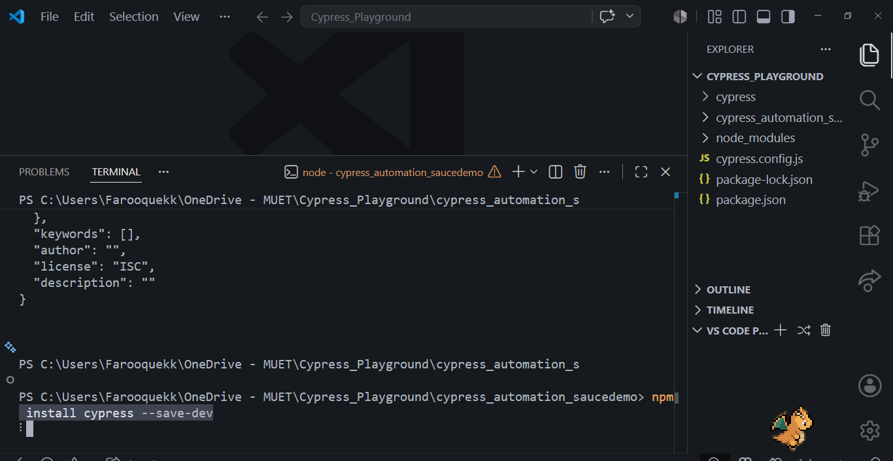
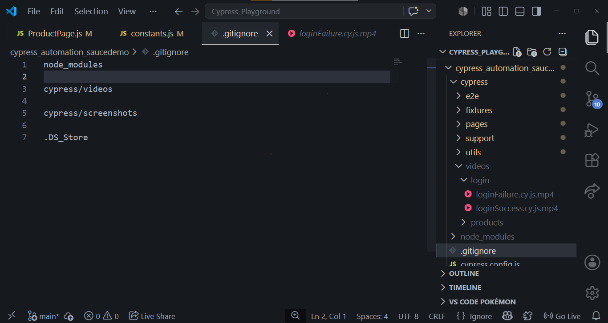
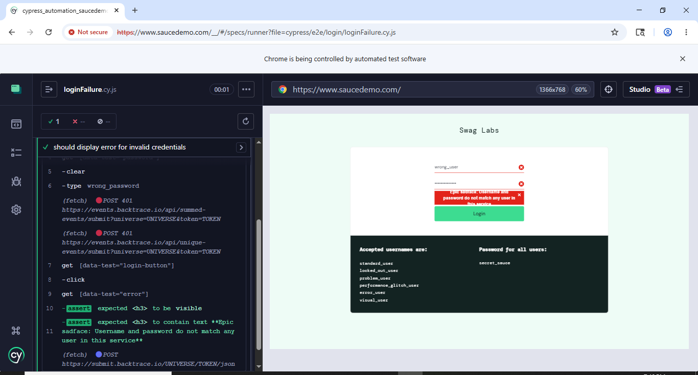
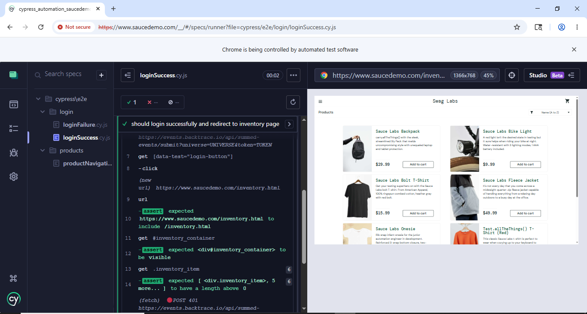
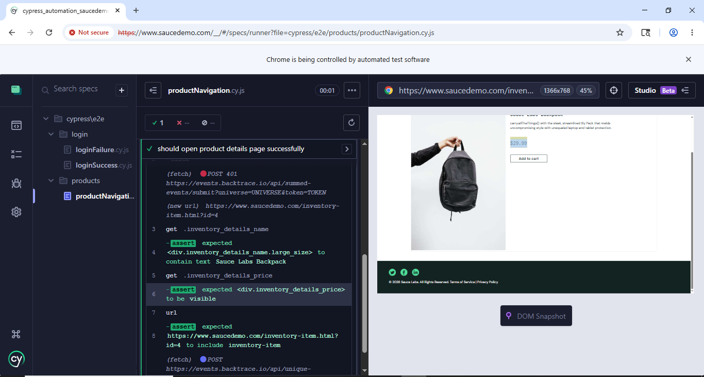
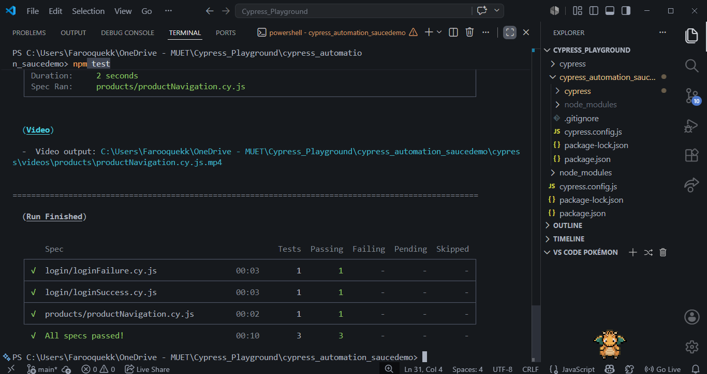

# Assignment No. 06 - Cypress Automation

## Project Overview

This assignment focuses on automating the SauceDemo web application using the Cypress Automation Framework.

The objective was to design and implement a maintainable UI automation framework following industry-standard automation practices including:

* Page Object Model (POM)
* Reusable Custom Commands
* Structured Test Suites
* DRY (Don't Repeat Yourself) Principles
* Git Version Control
* Modular Framework Design

The framework automates critical user workflows such as login validation and product navigation while maintaining clean code architecture and scalability.

---

# Learning Objectives

The following objectives were achieved during this assignment:

* Understanding Cypress automation fundamentals
* Implementing Page Object Model (POM)
* Creating reusable Cypress custom commands
* Automating login and navigation workflows
* Applying maintainable automation architecture
* Following industry-standard folder structure


---

# Technologies Used

| Technology        | Purpose                  |
| ----------------- | ------------------------ |
| Cypress           | UI Automation Framework  |
| JavaScript        | Test Development         |
| Node.js           | Runtime Environment      |
| Git               | Version Control          |
| GitHub            | Repository Management    |
| Page Object Model | Framework Design Pattern |

---

# Project Structure

```text
06_Assignment_06/
│
├── cypress_automation_project/
│   ├── cypress/
│   │   ├── e2e/
│   │   ├── fixtures/
│   │   ├── pages/
│   │   ├── support/
│   │   └── utils/
|   |   └── videos/
│   │
│   ├── package.json
│   ├── cypress.config.js
│   └── ...
│
├── workflow_report/
│   └── Assignment_06_Workflow_Report.pdf
│
├── screenshots/
│
└── README.md
```

---

# Cypress Installation & Setup

The Cypress project was initialized using Node.js and Cypress dependencies were installed successfully.

### Screenshot - Cypress Installation



---

# Framework Architecture

The project follows a clean and scalable folder structure based on industry standards.

### Key Components

#### Page Object Model (POM)

The following page classes were implemented:

* LoginPage
* InventoryPage
* ProductPage

#### Custom Commands

Reusable Cypress commands were created for:

* Login functionality
* Standard user authentication
* Common UI interactions

#### Fixtures

Test data is maintained separately using fixture files for improved maintainability.

### Screenshot - Project Structure



---

# Test Scenarios Implemented

The following automation scenarios were successfully implemented.

---

## Test Scenario 1 - Login Failure Validation

### Objective

Validate that the application correctly handles invalid login attempts.

### Steps

1. Navigate to SauceDemo login page.
2. Enter invalid username.
3. Enter invalid password.
4. Click Login button.
5. Verify error message.

### Expected Result

Application should reject authentication and display the appropriate error message.

### Screenshot – Login Failure Test



---

## Test Scenario 2 - Login Success Validation

### Objective

Validate successful user authentication.

### Steps

1. Navigate to login page.
2. Enter valid credentials.
3. Click Login.
4. Verify inventory page loads successfully.

### Expected Result

User should be redirected to inventory page and products should be displayed.

### Screenshot - Login Success Test



---

## Test Scenario 3 - Product Navigation Validation

### Objective

Validate navigation from inventory page to product details page.

### Steps

1. Login successfully.
2. Select a product.
3. Open product details page.
4. Verify product information.

### Expected Result

Product details page should load correctly and display product information.

### Screenshot - Product Navigation Test



---

# Test Execution

The automation suite was executed using Cypress Test Runner and terminal execution mode.

### Command Used

```bash
npm test
```

### Execution Result

* Login Failure Test → Passed
* Login Success Test → Passed
* Product Navigation Test → Passed

### Screenshot – Terminal Execution



---

# Framework Features

The implemented framework includes:

### Page Object Model

Provides separation of locators and business logic.

### Custom Commands

Reduces code duplication and improves readability.

### Fixture Management

Centralized test data management.

### Reusable Architecture

Framework can easily scale for additional modules and test cases.

### Git Integration

Version control maintained through Git and GitHub.

---

# Assignment Requirements Coverage

| Requirement                     | Status    |
| ------------------------------- | --------- |
| Setup Cypress Project           | Completed |
| Automate Login Failure Scenario | Completed |
| Automate Login Success Flow     | Completed |
| Homepage Validation             | Completed |
| Product Navigation Validation   | Completed |
| Create Custom Commands          | Completed |
| Apply Page Object Model         | Completed |

---

# Results Summary

All required test scenarios were successfully automated and executed.

The framework follows modern automation engineering practices and demonstrates:

* Clean Architecture
* Maintainability
* Reusability
* Scalability
* Industry-Standard Design Patterns

---

# Repository Contents

This submission includes:

* Cypress Automation Project
* Test Automation Framework
* Screenshots of Execution
* Workflow Report

---

# Conclusion

This assignment successfully demonstrates end-to-end UI automation using Cypress. Industry-standard practices such as Page Object Model, reusable custom commands, fixture management, and modular framework architecture were implemented to ensure maintainability and scalability. All required scenarios executed successfully, validating the effectiveness of the automation framework.
