# Assignment No. 07 - Playwright Automation on Daraz.pk

## Project Overview

This project automates an end-to-end product search flow on Daraz.pk using Playwright with JavaScript. The framework follows the Page Object Model (POM) design pattern and focuses on maintainability, scalability, readability, and reusability.

---

## Learning Objectives

* Learn Playwright automation fundamentals
* Implement Page Object Model (POM)
* Work with dynamic web elements and filters
* Create reusable page classes and utilities
* Generate Playwright execution reports
* Improve automation reliability using assertions and validations

---

# Installation

## Clone Repository

```bash
git clone https://github.com/Farooquekk/sqa-portfolio-10pearls.git
```

## Navigate to 07_Assignment_07 Project

```bash
cd sqa-portfolio-10pearls/07_Assignment_07/01_Playwright_Daraz_Automation
```

## Install Dependencies

```bash
npm install
```
---

### Screenshot

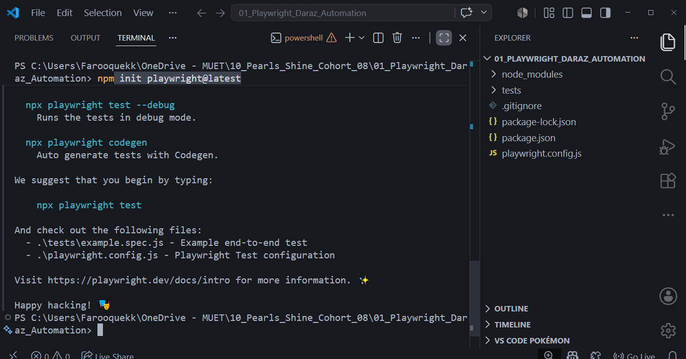

Description:

Terminal showing successful npm install execution.

---

# Project Structure

```text
01_Playwright_Daraz_Automation
│
├── src
│   ├── pages
│   │   ├── HomePage.js
│   │   ├── SearchResultsPage.js
│   │   └── ProductDetailsPage.js
│   │
│   ├── data
│   │   └── testData.js
│   ├── helpers
│   │   └── productHelpers.js
│   │ 
│   └── utils
│       ├── constants.js
│       └── logger.js
│
├── tests
│   └── darazSearchFlow.spec.js
│
├── playwright.config.js
├── package.json
└── README.md
```

### Screenshot 

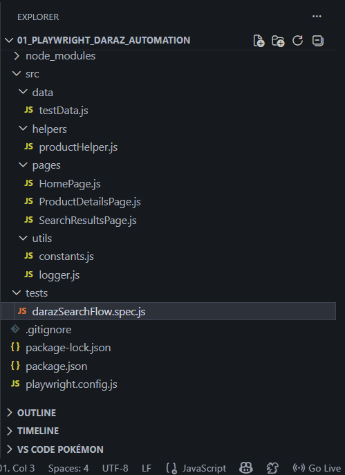


Description:

VS Code explorer showing complete project structure.

---

# Locator Strategy

The application was inspected using Chrome Developer Tools.

Different locator strategies were explored:

* Class Locators
* Placeholder Locators
* Role Locators
* Text Locators
* CSS Selectors

Examples:

```javascript
page.locator('input[type="search"]')
```

```javascript
page.locator('input[placeholder="Min"]')
```

```javascript
page.getByRole('checkbox')
```


### Screenshots

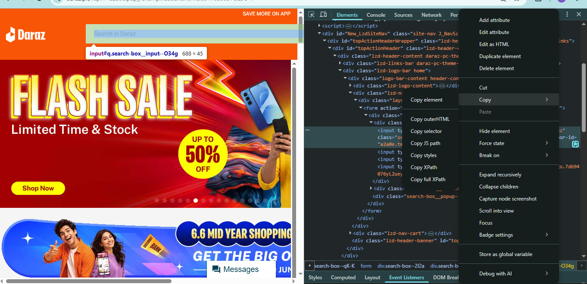

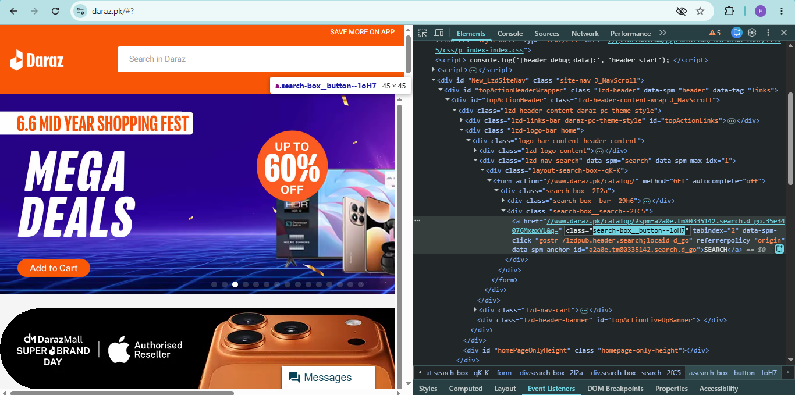

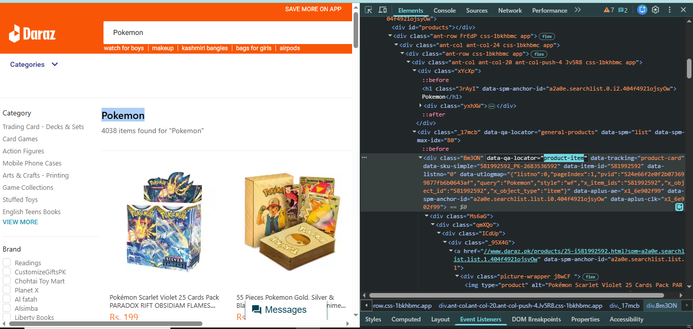

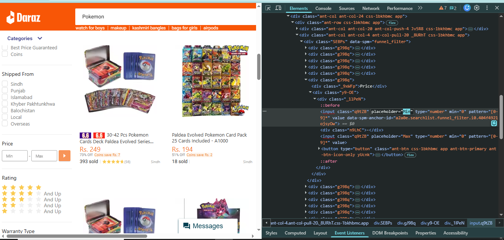

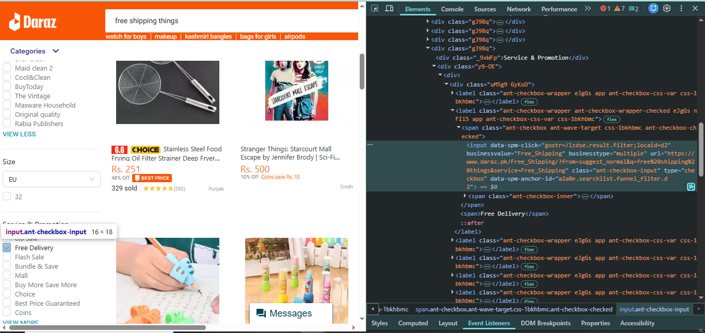

Description:

Developer Tools inspection showing element locator identification.

---

# Test Execution

The automation performs the following workflow:

1. Open Daraz.pk
2. Search for "electronics"
3. Apply price filter (500-5000)
4. Apply free delivery filter
5. Validate product count
6. Open first product
7. Validate product details page
8. Verify shipping information

---

### Screenshot


Daraz Homepage Loaded

---

### Screenshot

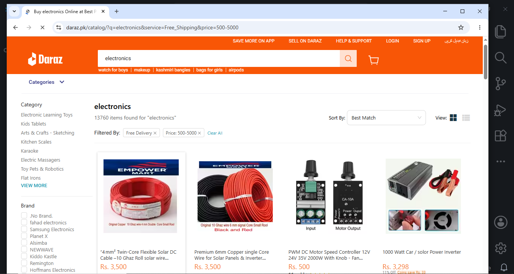

Search Results After Applying Filters

---

### Screenshot

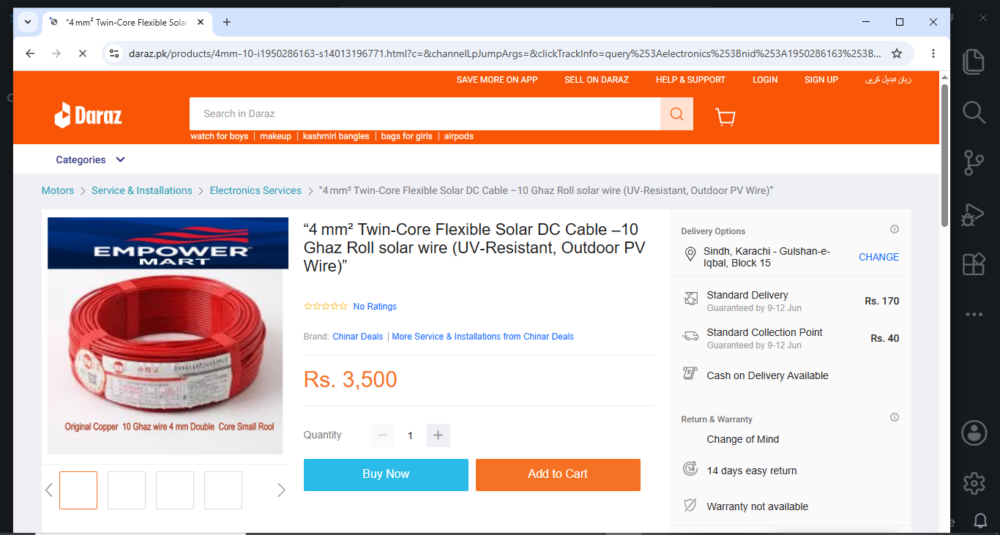

Product Details Page Opened

---

# Running Tests

Run all browsers:

```bash
npm test
```

Run in headed mode:

```bash
npm run test:headed
```

Run Playwright UI:

```bash
npm run test:ui
```

---

### Screenshot

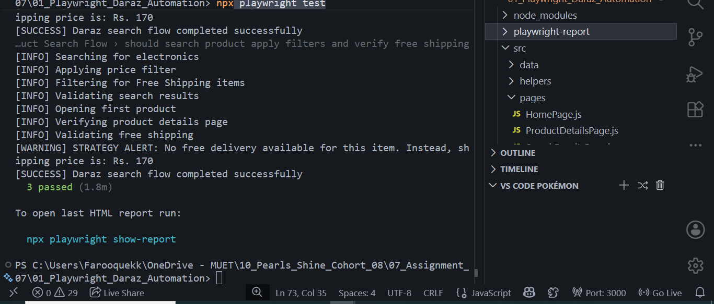

Description:

Terminal showing successful Playwright execution.

---

# Playwright HTML Report

Generate report:

```bash
npm run report
```

Playwright generates an HTML report containing:

* Execution Summary
* Browser Results
* Test Status
* Execution Time
* Screenshots
* Traces

### Screenshot

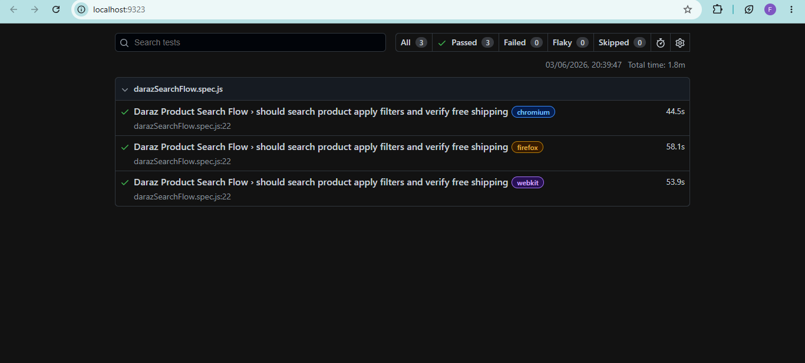

Description:

Playwright HTML report opened in browser.

---

# Conclusion

The automation framework successfully validates product search functionality on Daraz.pk using Playwright. The framework follows industry-standard automation practices including Page Object Model, reusable components, centralized test data management, logging utilities, and multi-browser execution support.
