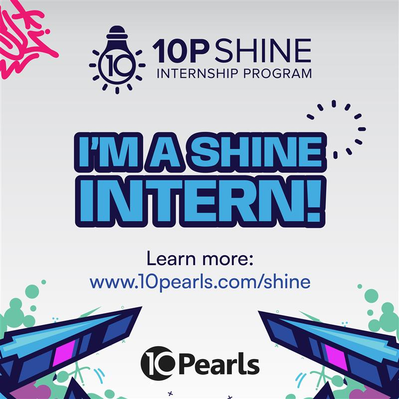

# Software Quality Assurance Portfolio

**Farooque Sajjad**

---

## Overview

This repository contains my assignments completed during my internship in Software Quality Assurance. Each assignment reflects my approach to understanding systems, analyzing requirements, and applying QA practices in a structured and practical way.

I follow a **learn by doing philosophy**. Instead of focusing only on theory, I aim to build real understanding by working on assignments, documenting my thought process, and improving with each iteration.

This repository will continue to evolve as I learn new tools, techniques, and industry practices.

---

## Internship Program

<!-- Replace the placeholder below with your official badge
[https://drive.google.com/file/d/1UJgg6u3gqqU0tEDFilYvrm7g65rkg1ZC/view?usp=drive_link]
(https://drive.google.com/drive/folders/1E3P_ehus5rYpDKHpZVj-giSf5tE6YDyf)
-->



---

## Assignments

### Assignment 01

**Requirement Analysis and User Story Writing for Online Book Store**

**Key Learnings:**

* Requirement Analysis (FR and NFR)
* User Story Writing
* Gherkin Syntax for Acceptance Criteria
* Sprint Planning and Story Point Estimation
* MoSCoW Prioritization
* Requirement Traceability Matrix (RTM)
* Understanding of basic system design for e-commerce workflows

**Summary:**
In this assignment, I analyzed an online bookstore system and documented complete requirements, user stories, and sprint plans. I also established traceability between requirements and user stories to ensure full coverage.

---

## Future Assignments

This repository will be updated regularly as I progress through my internship.

For each new assignment, I will document:

* Problem statement
* Approach and solution
* Tools and technologies used
* Key learnings

### Planned Skill Growth Areas

* Test Case Design and Execution
* API Testing (Postman and JMeter)
* Automation Testing Frameworks
* Selenium, Playwright, and Cypress
* Database Testing (SQL and NoSQL) *(not included in assignments but recommended by the instructor)*
* Bug Reporting
* CI/CD integration basics *(not included in assignments but planned for self-learning)*

Each assignment will reflect practical learning from these areas.

---

## Learning Approach

I prefer a hands-on approach to learning. I focus on:

* Understanding concepts by applying them
* Writing structured and clear documentation
* Improving based on feedback
* Building real-world problem-solving skills

---

## Communication and Growth

I consider myself an introverted person and not a strong communicator at this stage. However, I am committed to improving.

During my internship:

* I will actively participate in weekly meetings
* I will work on improving clarity in communication
* I will put consistent effort into both technical and professional growth

---

## Repository Structure

```
/01_Assignment_01_Name
/02_Assignment_02_Name
/03_Assignment_03_Name
/...
/assets
README.md
```

Each folder contains:

* Assignment document, code files, and artifacts
* Supporting files (if any)

---

## Goal

The goal of this repository is to:

* Track my learning progress
* Build a strong QA foundation
* Create a professional portfolio for future opportunities

---

## Contact

Email: [farooquekk92@gmail.com](mailto:farooquekk92@gmail.com)

Portfolio: [My Portfolio Link](https://portfolio-farooquekks-projects.vercel.app/)

LinkedIn: [My LinkedIn Account Link](https://www.linkedin.com/in/farooque-sajjad-233b41282/)

---
